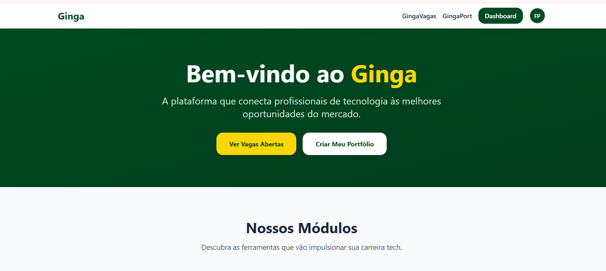

# Ginga API



API REST do **Ginga** em **FastAPI**: PostgreSQL assíncrono (SQLAlchemy 2 + **asyncpg**), autenticação **JWT AWS Cognito** (JWKS), uploads via **S3** (URLs assinadas), deploy em **AWS Lambda** com **Mangum** (imagem no **ECR**), no mesmo padrão do projeto pet-control.

O schema usa prefixo `api_*` nas tabelas para conviver com outros consumidores no mesmo PostgreSQL, se necessário.

## Repositório

- **Código da API:** `app/`, `lambda_handler.py`, `alembic.ini`, `scripts/`.
- **`frontend/`:** interface web (**React**, Vite + TypeScript + Tailwind), login Cognito (Amplify v6) e cliente HTTP com Bearer (ID token). Ver [frontend/README.md](frontend/README.md).
- **Migração de dados legados:** [docs/DATA_MIGRATION.md](docs/DATA_MIGRATION.md).

## Frontend (React)

- **Pasta:** `frontend/`.
- **Variáveis:** copie `frontend/.env.example` para `frontend/.env` e preencha `VITE_API_BASE_URL`, `VITE_AWS_REGION`, `VITE_COGNITO_USER_POOL_ID`, `VITE_COGNITO_USER_POOL_CLIENT_ID` (mesmos conceitos dos outputs Terraform `ginga_cognito_*` / variáveis `COGNITO_*` da API).
- **CORS em produção:** a API usa `FRONTEND_URL` (Lambda / env) para a origem permitida. Defina com a URL exata do app React em produção (ex.: `https://app.exemplo.com`); em testes locais pode usar `http://localhost:5173` ou `*` conforme a política do ambiente.

## Stack

- Python 3.12+
- [uv](https://docs.astral.sh/uv/)
- PostgreSQL
- Ruff

## Configuração

```bash
cp .env.example .env
```

Principais variáveis: `DATABASE_URL` (`postgresql+asyncpg://...`), `COGNITO_*`, `FRONTEND_URL`, `S3_*`. Em desenvolvimento, `DEV_AUTH_BYPASS=true` + `DEV_AUTH_BYPASS_SECRET` permitem testar sem Cognito (nunca em produção).

## Instalação e execução local

```bash
uv sync
uv run alembic upgrade head
uv run python scripts/load_techs.py
uv run uvicorn app.main:app --reload --host 0.0.0.0 --port 8000
```

- OpenAPI: `http://localhost:8000/docs`
- Health: `GET http://localhost:8000/health`

## Docker Compose (API + Postgres)

```bash
docker compose up --build
```

O serviço `api` roda `alembic upgrade head` antes do Uvicorn. Ajuste `.env` se necessário; o compose define `DATABASE_URL` para o serviço `db`.

## Migrações (Alembic)

```bash
uv run alembic upgrade head
```

## Seed de tags (autocomplete)

```bash
uv run python scripts/load_techs.py
```

Idempotente.

## Deploy (AWS)

Infraestrutura (ECR, Lambda Function URL, Cognito, S3, database `ginga` no RDS existente) está no repositório **marujos-terraform** (`ginga_*.tf`). Fluxo típico:

1. `docker build -t ginga-api .` e push da imagem para o ECR `ginga-api`.
2. Atualizar a Lambda para a nova imagem (ou `terraform apply` após definir a tag).
3. Rodar `alembic upgrade head` contra o `DATABASE_URL` de produção (CI ou máquina com acesso ao RDS).

## Qualidade

```bash
uv run ruff check app lambda_handler.py scripts
```

## Contribuição

1. Fork e branch (`feature/...`).
2. `uv run ruff check` antes do PR.
